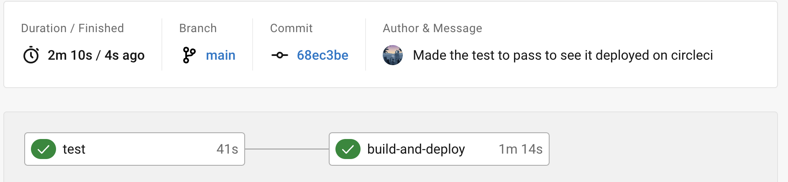

# This is for **Shelter**

I have answered the questions as best I could.

I've spent the day to use the tech stack you've requested the applicants to have experience in. I thoroughly enjoyed doing the following:

- [x] Using gatsby and figuring out the difference between page component which has access to more than `props`
- [x] Ordinary component that gets `props` handed down
- [x] Utilising `Contentful` to have images and content stored
- [x] Using `GraphQL` to query for said data (I'm used to the REST API protocol).
- [x] Wrote this using TypeScript (I'm still picking it up and really enjoying it)
- [x] Guess what the minimal CSS was with, you guessed it! `tailwind`
- [x] Done some minor testing for the `Card` component
- [x] Deployed using `Netlify`
- [x] Integrated `CircleCI

CircleCI is one that I need to read up on a bit more but was not long to setup and the general idea behind it is quite interesting.

This sums it up from a basic standpoint: test / tests fail -> dont deploy || test / tests pass -> deploy to netlify

I can assure you that I'm a person who loves to explore and learn new things whilst going above and beyond when necessary. An example of this would be when I had to teach a cohor of 100+ students and dedicated out of hours support sessions to ensure they would have the best possible chance of succeeding.

Hope to hear from you,

Regards,

Hamza
